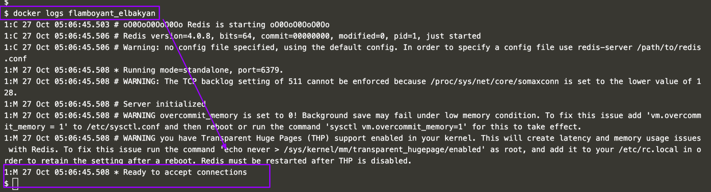

### Introduction

In this first scenario, you'll take the role of Jane, a developer who needs to deploy a new Key-Value Store for an application she's working with. After discussions, it's been decided to use Redis, a popular KV Store.

Jane is unfamiliar with how Redis is deployed but has heard Docker makes it straightforward to deploy services into development and production.

This scenario discusses how she will complete her task and deploy Redis as a Docker Container.

Jane's development environment has access to latest version of the Docker Engine via a machine called docker. Her local dev machine has the Docker Client installed and accessible via the command line.

### What Is Docker?

Docker describes themselves as `"an open platform for developers and sysadmins to build, ship, and run distributed applications"`.

#### Docker allows you to run containers. 
A container is a sandboxed process running an application and its dependencies on the host operating system. 
The application inside the container considers itself to be the only process running on the machine while the machine can run multiple containers independently.

### Step 1 - Running A Container

The first task is to identify the name of the Docker Image which is configured to run Redis. With Docker, all containers are started based on a Docker Image. These images contain everything required to launch the process; the host doesn't require any configuration or dependencies.

Jane can find existing images at registry.hub.docker.com/ or by using the command docker search <name>. For example, to find an image for Redis, you would use `docker search redis`.

#### Task
Using the search command, Jane has identified that the Redis Docker Image is called redis and wants to run the latest release. Because Redis is a database, Jane wants to run it as a background service while she continues to work.

To complete this step, launch a container in the background running an instance of Redis based on the official image.

The Docker CLI has a command called run which will start a container based on a Docker Image. The structure is docker run <options> <image-name>.

By default, Docker will run a command in the foreground. To run in the background, the option -d needs to be specified.

`docker run -d redis`

By default, Docker will run the latest version available. If a particular version was required, it could be specified as a tag, for example, version 3.2 would be `docker run -d redis:3.2`.

As this is the first time Jane is using the Redis image, it will be downloaded onto the Docker Host machine.

### Step 2 - Finding Running Containers
The launched container is running in the background, the `docker ps` command lists all running containers, the image used to start the container and uptime.

This command also displays the friendly name and ID that can be used to find out information about individual containers.

The command `docker inspect <friendly-name|container-id>` provides more details about a running container, such as IP address.

The command `docker logs <friendly-name|container-id>` will display messages the container has written to standard error or standard out.

### Step 3 - Accessing Redis

Jane is happy that Redis is running, but is surprised that she cannot access it. The reason is that each container is sandboxed. If a service needs to be accessible by a process not running in a container, then the port needs to be exposed via the Host.

Once exposed, it is possible to access the process as if it were running on the host OS itself.

Jane knows that by default, Redis runs on port 6379. She has learned that by default other applications and library expect a Redis instance to be listening on the port.

#### Task
After reading the documentation, Jane discovers that ports are bound when containers are started using `-p <host-port>:<container-port>` option. Jane also discovers that it's useful to define a name when starting the container, this means she doesn't have to use Bash piping or keep looking up the name when trying to access the logs.

Jane finds the best way to solve her problem of running Redis in the background, with a name of redisHostPort on port 6379 is using the following command `docker run -d --name redisHostPort -p 6379:6379 redis:latest`

Protip
By default, the port on the host is mapped to 0.0.0.0, which means all IP addresses. You can specify a particular IP address when you define the port mapping, for example, -p 127.0.0.1:6379:6379

### Step 4 - Accessing Redis
The problem with running processes on a fixed port is that you can only run one instance. Jane would prefer to run multiple Redis instances and configure the application depending on which port Redis is running on.

#### Task

After experimenting, Jane discovers that just using the option -p 6379 enables her to expose Redis but on a randomly available port. She decides to test her theory using docker run -d --name redisDynamic -p 6379 redis:latest

While this works, she now doesn't know which port has been assigned. Thankfully, this is discovered via `docker port redisDynamic 6379`

Jane also finds that listing the containers displays the port mapping information, docker ps

#### Step 5 - Persisting Data

After working with containers for a few days, Jane realises that the data stored keeps being removed when she deletes and re-creates a container. Jane needs the data to be persisted and reused when she recreates a container.

Containers are designed to be stateless. Binding directories (also known as volumes) is done using the option -v <host-dir>:<container-dir>. When a directory is mounted, the files which exist in that directory on the host can be accessed by the container and any data changed/written to the directory inside the container will be stored on the host. This allows you to upgrade or change containers without losing your data.

#### Task

Using the Docker Hub documentation for Redis, Jane has investigated that the official Redis image stores logs and data into a /data directory.

Any data which needs to be saved on the Docker Host, and not inside containers, should be stored in /opt/docker/data/redis.

The complete command to solve the task is `docker run -d --name redisMapped -v /opt/docker/data/redis:/data redis`

Protip
Docker allows you to use $PWD as a placeholder for the current directory.

### Step 6 - Running A Container In The Foreground
Jane has been working with Redis as a background process. Jane wonders how containers work with foreground processes, such as ps or bash.

Previously, Jane used the -d to execute the container in a detached, background, state. Without specifying this, the container would run in the foreground. If Jane wanted to interact with the container (for example, to access a bash shell) she could include the options -it.

As well as defining whether the container runs in the background or foreground, certain images allow you to override the command used to launch the image. Being able to replace the default command makes it possible to have a single image that can be re-purposed in multiple ways. For example, the Ubuntu image can either run OS commands or run an interactive bash prompt using /bin/bash

Example
The command docker run ubuntu ps launches an Ubuntu container and executes the command ps to view all the processes running in a container.

Using docker run -it ubuntu bash allows Jane to get access to a bash shell inside of a container.

#### Reference

https://katacoda.com/courses/docker/deploying-first-container