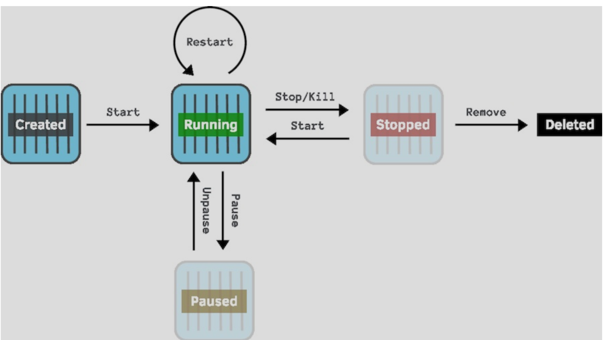

Docker compose


```

version: '3'

services:
  web:
    build: 
      context: .
      dockerfile: Dockerfile.002
    image: railsapp:004
    ports:
      - "3000:3000"

```

`docker-compose build`

docker-compose -f docker-compose.yml build

```
Building web
Step 1/9 : FROM ruby:2.6
 ---> 7876e09efe18
Step 2/9 : RUN apt-get update -yqq && apt-get install -yqq --no-install-recommends nodejs
 ---> Running in 7af04f8475ba
...
```


We can now run

`docker-compose -f docker-compose.yml build`

or

`docker run -p 3000:3000 railsapp:004`


Mouting Local Volume

create `docker-compose.mount.yml`

```

version: '3'

services:
  web:
    build: 
      context: .
      dockerfile: Dockerfile.002
    image: railsapp:004
    ports:
      - "3000:3000"
    volumes:
    - .:/usr/src/app/

```

With following declaratio

```
    volumes:
    - .:/usr/src/app/
```

We can mount our current working dir and Docker can help to update (sync) changed to Docker container


### Docker composer operations




docker-compose ps

docker-compose stop <service_name>
eg

docke-compose stop web


docke-compose start web

docke-compose restart web


View logs

docke-compose logs -f web


Running one-off command

docke-compose run --rm web echo "ran a different command"

or

docke-compose exec web echo "ran a different command"

without spinning new container


### Troubleshooting


Since rails 6, webpack is enabled by default. We might have following issue when starting Rails app

```
Starting app_web_1 ... done
Attaching to app_web_1
web_1  | => Booting Puma
web_1  | => Rails 6.0.3.4 application starting in development
web_1  | => Run `rails server --help` for more startup options
web_1  | Exiting
web_1  | /usr/local/bundle/gems/webpacker-4.3.0/lib/webpacker/configuration.rb:95:in `rescue in load': Webpacker configuration file not found /usr/src/app/config/webpacker.yml. Please run rails webpacker:install Error: No such file or directory @ rb_sysopen - /usr/src/app/config/webpacker.yml (RuntimeError)
```

Solution:

```
 docker-compose -f docker-compose.mount.yml run --rm web bin/rails webpacker:install
```

should have similar output


```

Done in 28.86s.
Installing dev server for live reloading
         run  yarn add --dev webpack-dev-server from "."
yarn add v1.22.5
[1/4] Resolving packages...
[2/4] Fetching packages...
info fsevents@2.1.3: The platform "linux" is incompatible with this module.
info "fsevents@2.1.3" is an optional dependency and failed compatibility check. Excluding it from installation.
info fsevents@1.2.13: The platform "linux" is incompatible with this module.
info "fsevents@1.2.13" is an optional dependency and failed compatibility check. Excluding it from installation.
[3/4] Linking dependencies...
warning "webpack-dev-server > webpack-dev-middleware@3.7.2" has unmet peer dependency "webpack@^4.0.0".
warning " > webpack-dev-server@3.11.0" has unmet peer dependency "webpack@^4.0.0 || ^5.0.0".
[4/4] Building fresh packages...
success Saved lockfile.
success Saved 102 new dependencies.
info Direct dependencies
└─ webpack-dev-server@3.11.0
info All dependencies
.....

├─ utils-merge@1.0.1
├─ wbuf@1.7.3
├─ webpack-dev-middleware@3.7.2
├─ webpack-dev-server@3.11.0
└─ ws@6.2.1
Done in 9.14s.
Webpacker successfully installed 🎉 🍰
```


Now we can start app

```
~/projects/app$ docker-compose -f docker-compose.mount.yml up
Recreating app_web_1 ... done
Attaching to app_web_1
web_1  | => Booting Puma
web_1  | => Rails 6.0.3.4 application starting in development
web_1  | => Run `rails server --help` for more startup options
web_1  | Puma starting in single mode...
web_1  | * Version 4.3.6 (ruby 2.6.6-p146), codename: Mysterious Traveller
web_1  | * Min threads: 5, max threads: 5
web_1  | * Environment: development
web_1  | * Listening on tcp://0.0.0.0:3000
web_1  | Use Ctrl-C to stop

```